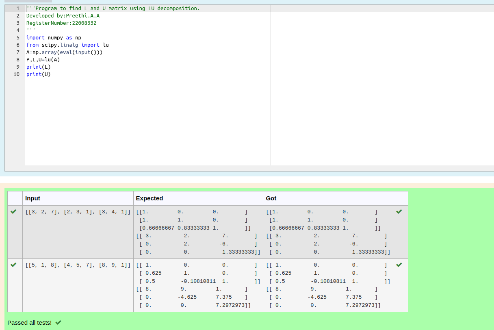
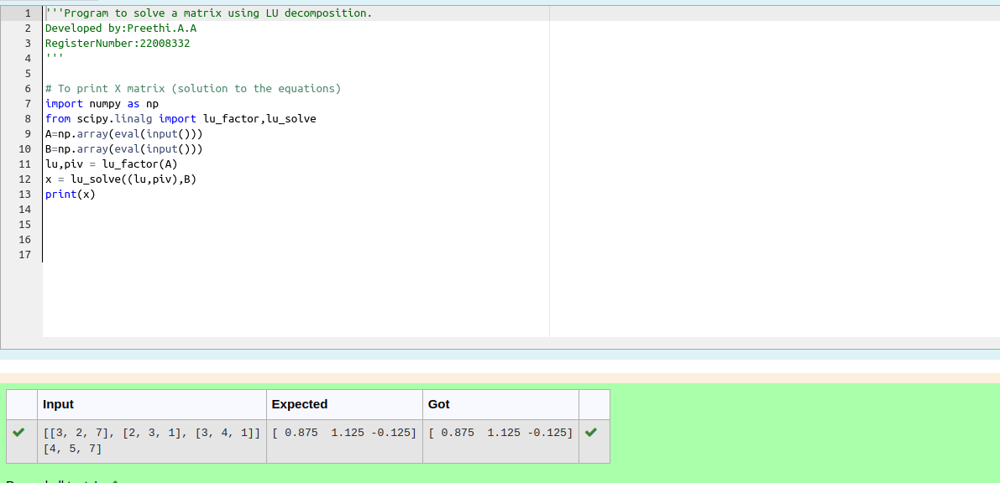

# LU Decomposition 

## AIM:

To write a program to find the LU Decomposition of a matrix.

## Equipments Required:

1. Hardware – PCs
2. Anaconda – Python 3.7 Installation / Moodle-Code Runner

## Algorithm

1.Get the list of values from the user.

2.Declare the function starting with numpy.

3.Print the result finally.

4.Display the output.

## Program:
(i) To find the L and U matrix
```
/*
```python
'''Program to find L and U matrix using LU decomposition.
Developed by:Preethi.A.A
RegisterNumber:22008332
'''
#To find L and U using LU-Decomposition.
import numpy as np
from scipy.linalg import lu
A=np.array(eval(input()))
P,L,U=lu(A)
print(L)
print(U)

*/

```
(ii) To find the LU Decomposition of a matrix
```
/*
```python 
'''Program to solve a matrix using LU decomposition.
Developed by:Preethi.A.A 
RegisterNumber:22008332
'''

# To print X matrix (solution to the equations)
import numpy as np
from scipy.linalg import lu_factor,lu_solve
A=np.array(eval(input()))
B=np.array(eval(input()))
lu,piv = lu_factor(A)
x = lu_solve((lu,piv),B)
print(x)

*/
```

## Output:




## Result:

Thus the program to find the LU Decomposition of a matrix is written and verified using python programming.

